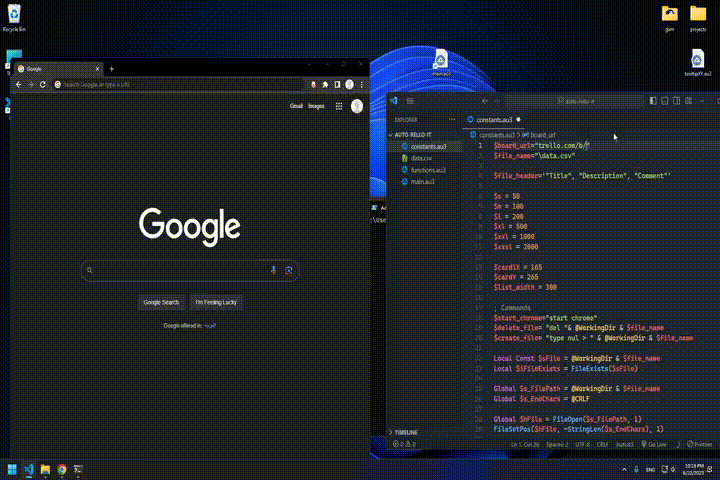

### alpha version!!!

<h1 align="center">
  auto-rello-it
</h1>

  
 

## Demo video

<em>for version: v0.1.0</em>

### Hot Keys:

F10 to quit the running script

### Notes:

#### Using the script

- warm up your trello page, or use warmup function
- use trello in white mode
- have a chrome tab opened up
- Warm up your trello board, or use commented warmup function.
- If mouse tooltip showed: Waiting... for too long, restart the script.

#### CSV Data format

- The ',' character, is replaced with the hexadecimal value '0x2C'
- end line (LF & CRLF) are replaced with '\n'
- Trello left side-bar must be closed.
- For screens with 1920\*1080 dimensions.
- Use trello in white mode.
- Better to have a chrome tab opened up.

### Usage

### Available factors

- $s -> $xxxl :
  global static time sleep speed

- $tf {time factor} available in network blocked actions :
  function scoped time speed factors
